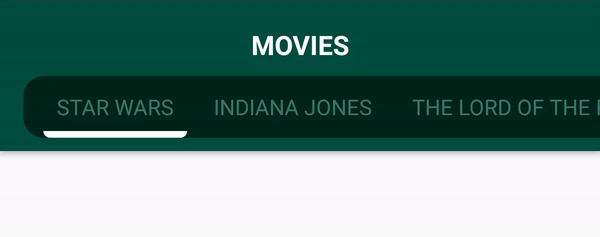
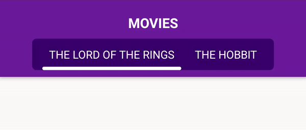
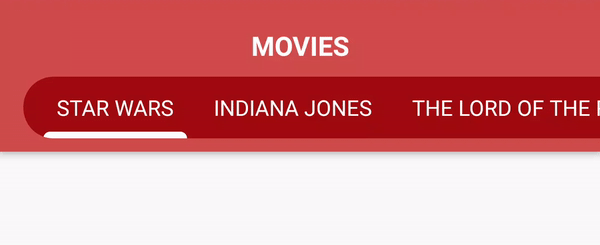

# Customizable RoundedTabBarLayout for Android .    [](https://jitpack.io/#degordian/RoundedTabBarLayout)

If you're ever in need of a fresh, different TabLayout for Android, check this out! <br>
It offers "box-like" behavior for tab items and the entire box scrolls as the
tab items are tapped on. <br>
Also, it's customizable with more customizations coming soon!

 ## Samples
 
 
 
 
 
## To use this customized tab layout in your Android project

1. Add jitpack.io classpath to your root build.gradle file

```gradle
allprojects {
  repositories {
    ...
    maven { url 'https://jitpack.io' }
  }
}
```

2. Add library dependency to your app build.gradle

```gradle
dependencies {
  implementation 'com.github.degordian:roundedtabbarlayout:{latest-version}'
}
```

## How to use RoundedTabBarLayout?

### Extend the RoundedTabBar<T> class
For maximal flexibility, you need to extend the RoundedTabBar<T> class and replace
the generic T with your own custom class type.
When using Kotlin, don't forget to add @JvmOverloads annotation so it can properly inflate
the view from the XML layout.

```kotlin
// Your custom class representing one item in TabLayout
data class TabItem(
    val id: Long,
    val title
)
    
class DemoRoundedTabBar @JvmOverloads constructor(
    context: Context,
    attrs: AttributeSet? = null,
    defStyleAttr: Int = 0
) : RoundedTabBar<TabItem>(context, attrs, defStyleAttr)
```

### Use the newly created view in the XML and customize:
  1. background color (rtb_background_color; default <b>black</b>)
  2. text color (rtb_text_color; default <b>white</b>)
  3. indicator drawable (rtb_indicator_drawable or any color for a rectangular indicator)
  4. Capsized text (textAllCaps; default <b>true</b>)
  
  
```xml
 <com.bornfight.roundedtabbarlayoutlibrary.DemoRoundedTabBar
            android:id="@+id/tabBar"
            android:layout_marginTop="24dp"
            app:rtb_corner_radius="32dp"
            app:rtb_background_color="@color/colorPrimaryDark"
            app:rtb_text_color="#FFF"
            app:rtb_indicator_drawable="@drawable/tab_indicator"
            android:textAllCaps="false"
            android:layout_width="match_parent"
            android:layout_height="wrap_content"/>
```

Now you can use the customized tab layout in your activity or a fragment by
setting the items and listener.
  
```kotlin
val tabItems = listOf(
            TabItem(0, "Star Wars"),
            TabItem(1, "Indiana Jones"),
            TabItem(2, "The Lord Of The Rings"),
            TabItem(3, "The Hobbit"),
            TabItem(3, "Star Trek"))

tabBar.setItems(tabItems) { item, holder ->
            // you can display any content you want from your custom class
            holder.tabNameView.text = item.title
}
        
tabBar.listener = object : RoundedTabBar.OnRoundedTabBarItemInteractionListener<TabItem> {
            override fun onRoundedTabBarItemClicked(item: TabItem) {
                Toast.makeText(this@DemoActivity, 
                               "Tab " + item.title + " clicked!", 
                               Toast.LENGTH_SHORT).show()
       }
}
```
 
 


